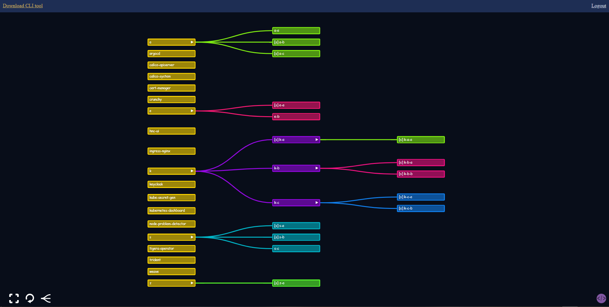

# Intro
UI for [hierarchical namespaces in kubernetes](https://github.com/kubernetes-sigs/hierarchical-namespaces)

# Usage
```bash
helm repo add zfrhv https://zfrhv.github.io/hnc-ui
helm repo update
helm install k8s-hnc-ui zfrhv/hnc-ui -n hnc-ui --create-namespace --set k8s.ingress.host=hnc.test
```
for openshift installation
```bash
helm install k8s-hnc-ui zfrhv/hnc-ui -n hnc-ui --create-namespace --set ocp.ingress.host=hnc.test --set openshift=true
```
you can view additional example [here](./charts/hnc-ui/examples)

# Concept
### Basic workflow
1. The hnc-ui watches for namespaces that is included by hnc (via label `hnc.x-k8s.io/included-namespace: "true"`) with its service account token.
2. each client that connects attempts to watch each namespaces that hnc-ui sees + hrqs in same namespace + quota using the user token. If env `USE_SA_TOKEN: "true"` specified then serviceAccount token is used instead.

## Client side (index.html)
The tree diagram is made with `d3.js`.  

# Example pictures:



You can easily view and manage your namespaces by simply right clicking!  
Live updates by using kubernetes watch!

### maybe todo
- allow change namespace parent
- add cascading deletion button
- add modify hrq from the ui
- add question mark at top right that will explain
  - /metrics
  - right click features
