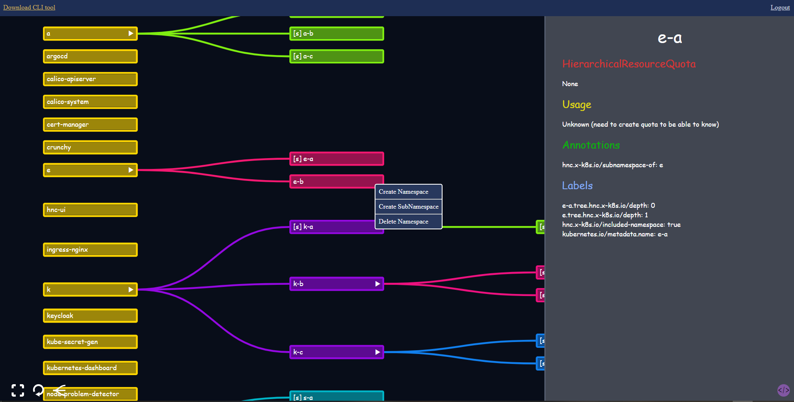

# Intro
UI for [hierarchical namespaces in kubernetes](https://github.com/kubernetes-sigs/hierarchical-namespaces)

# Usage
```bash
helm repo add zfrhv https://zfrhv.github.io/hnc-ui
helm repo update
helm install k8s-hnc-ui -n hnc-ui --create-namespace --set k8s.ingress.host=hnc.test zfrhv/hnc-ui
```
for openshift configure in values.yaml
```yaml
openshift: true
```

# Concept
### Basic workflow
1. The hnc-ui watches for namespaces that is included by hnc (via label `hnc.x-k8s.io/included-namespace: "true"`) with its service account token.
2. each client that connects attempts to watch each namespaces that hnc-ui sees + hrqs in same namespace + quota using the user token. If env `USE_SA_TOKEN: "true"` specified then serviceAccount token is used instead.

Example values.yaml are located inside the chart under [`examples`](./hnc-ui/examles) directory.

## Client side (index.html)
The tree diagram is made with `d3.js`.  

# Example pictures:



You can easily view and manage your namespaces by simply right clicking!  
Live updates by using kubernetes watch!
